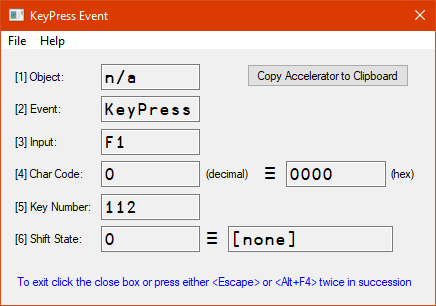

# The `]KeyPress` user command

`]KeyPress` shows a small GUI that reports the details of any key pressed on the keyboard.

Naturally this is a Windows-only utility.

This user command fires up a stand-alone EXE created with Dyalog. This is a necessary measure  in order to avoid any hot keys from `⎕SE` inteferring with the GUI: the hot keys take precedence!

For quitting the application, you need to hit either the `<escape>` key or the `Alt+F4` key twice in succession .
